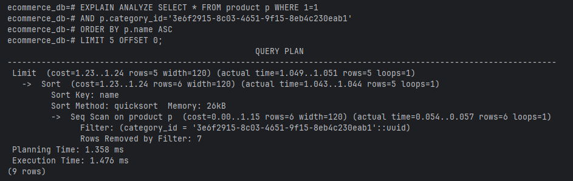

# Performance Analysis

## Caching Comparative Analysis

**Question:** How much does caching improve retrieval speed?

NB: Cache being used is a db cache to cache database results

### Results

#### Without Cache:

Here, the average speed when retrieving all products is:

$ \dfrac{3 + 0 + 2 + 3 + 3}{5} = \dfrac{11}{5} \approx 2.2ms$

#### With Cache:

Here, the average speed when retrieving all products is:

$ \dfrac{7 + 0 + 0 + 0 + 0}{5} = \dfrac{7}{5} \approx 1.4ms$

### Observation

Even though retrieval without fetching starts at a relatively higher time of retrieval, probably due to more
computations needed to cache results, we see the time for retrieval drop significantly after the data retrieved
has been cached.

As a result, an implementation with a db cache offers significantly better results.

## SQL Query Comparative Analsis: Simple v Complex

**Question:** How much does optimizing sql queries improve retrieval and search speed?

### Results

#### Prior to optimization

*Query to retrieve all products in a particular category*

#### After optimization

*Query to retrieve all products in a particular category*